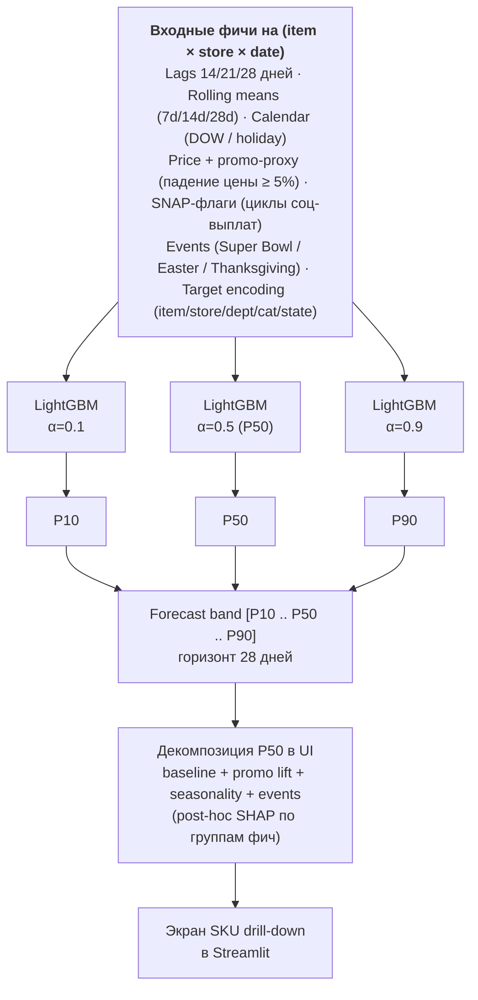
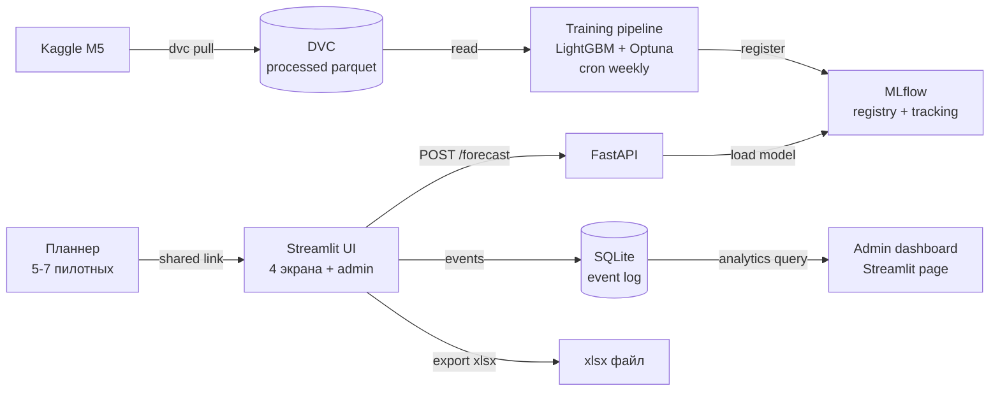

# Прототип: weekly demand forecast service для FMCG demand planner

ДЗ №2 учебного проекта MFDP 2026. Документ описывает прототип, на котором проверяется одна ключевая гипотеза перед тем, как разворачивать полный pipeline из [hw1/business_analysis.md](../hw1/business_analysis.md).

## Контекст и связь с hw1

В hw1 описаны четыре задачи на одном датасете M5 (forecasting, elasticity, promo uplift, optimization). Для прототипа выбрана **одна задача - иерархический forecast продаж** с явно адресной аудиторией: demand planner FMCG-производителя (PepsiCo и аналоги). Остальные три задачи переносятся в roadmap и в прототипе намеренно не реализуются.

Сегмент B выбран исходя из доступа к живым пользователям: автор работает в PepsiCo, у demand-планнеров FMCG есть еженедельная потребность в инструменте поддержки прогнозирования. Это даёт прототипу настоящих пилотных пользователей.

**Целевой рынок продукта шире**, чем один пилотный сегмент:

- **FMCG-производители** (PepsiCo, Mars, Unilever, Wimm-Bill-Dann, Nestlé, ...) - прогноз sell-out своих SKU через retail-каналы для S&OP / trade-marketing;
- **Крупные ритейл-сети** (X5, Магнит, Лента, Ашан, ...) - прогноз спроса по всему ассортименту в своих магазинах для пополнения и ценообразования.

Job demand planning у них общий, отличается **только угол разреза данных**: FMCG смотрит на свои SKU через множество retail-каналов; ритейл смотрит на множество брендов в своих магазинах. M5 (sell-out Walmart) ближе по структуре к ритейл-сценарию, и одновременно служит proxy для FMCG-производителя в части «как наши SKU продаются у одного крупного ритейл-партнёра».

M5 (sell-out по `item × store × date` с историей цен и календарём событий) — **наиболее открытый и репрезентативный retail-датасет**: это реальные данные Walmart по 3 штатам × 10 магазинам × 5 годам. На M5 пилот **доказывает качество forecasting на retail-данных**; параллели и расхождения с данными конкретного клиента (PepsiCo POS-feed, X5/Магнит/Лента) разбираются в разделе «Связь M5 и данных клиента» ниже — чтобы заранее зафиксировать, что именно надо будет поменять при retraining под клиента.

## JTBD-сценарий

> Когда я готовлю **еженедельный demand review** по своей категории (порядка 200–500 SKU × ритейл-чейн × регион) для **monthly S&OP-цикла**, у меня **1.5–2 часа в среду** до митинга и горизонт прогноза 4 недели, я хочу быстро увидеть, **по каким SKU модель уверена** (узкий интервал P10–P90, явно учтённые промо-календарь, события и циклы социальных выплат) и где есть **аномалии или low-confidence**, чтобы сосредоточить ручную правку на **проблемных 15–25% ассортимента**, а не пересматривать все 500 строк в Excel, и чувствовать себя контролирующим процесс через приоритезацию, а не реактивно правящим всё подряд.

Замечание о консистентности: «15–25% правок» в JTBD - это **vision** (целевое состояние через несколько итераций продукта). Ближайший first milestone в гипотезе ниже - accept rate ≥ 60%, что соответствует 40% правок. Это разрыв намеренный: пилот валидирует траекторию, не финальную точку.

Один JTBD - один сегмент. Дальнейший документ описывает прототип, который закрывает именно этот сценарий и **только его**.

## 1. Ключевая гипотеза

> Если мы предлагаем **сервис weekly demand forecast с квантильным прогнозом P10/P50/P90 на 4 недели вперёд и явной декомпозицией forecast (baseline + promo lift + seasonality + events)** для **demand planner'ов FMCG-производителя, отвечающих за 200–500 SKU × ритейл-чейн × регион в категории ambient foods (proxy от M5: FOODS-категория, sub-departments FOODS_1/2/3 без явной маркировки snacks/beverages - для прототипа достаточно общей категории)** в сценарии **еженедельного demand review в рамках monthly S&OP-цикла**, то мы получим **forecast accept rate (доля SKU, для которых планнер не правит точечный прогноз вручную) не меньше 60% и сокращение времени на review одной категории с 90 до 45 минут** в течение **8-недельного пилота с 5–7 планнерами (4 недели обучения и адаптации + 4 недели измерений)** потому что **модель явно учитывает promo-календарь, лаги, события и циклы социальных выплат, которые планнер физически не успевает обработать вручную для всего ассортимента, а quantile range P10–P90 в UI показывает, где модель неуверена и где действительно нужна ручная корректировка.**

Расшифровка переменных:

| Перемен. | Значение |
| -------- | -------- |
| **A** (продукт) | Web-сервис weekly demand forecast: квантильный прогноз P10/P50/P90 на 28 дней вперёд + декомпозиция (baseline / promo / seasonality / events) + accept/edit/comment workflow |
| **B** (сегмент) | Demand planner FMCG-производителя, ответственный за категорию из 200–500 SKU × ритейл-чейн × регион. Активен 1–2 раза в неделю в demand-review цикле в рамках monthly S&OP |
| **C** (сценарий) | Еженедельный demand review на 4 недели вперёд в рамках monthly S&OP-цикла |
| **D** (метрика) | Forecast accept rate (главная) + сокращение time-on-task (поддерживающая) |
| **E** (порог) | accept rate ≥ 60%, время с 90 → ≤ 45 мин |
| **T** (срок) | 8 недель пилота: weeks 1–4 - обучение и адаптация, weeks 5–8 - замеры |
| **причина** | Модель учитывает факторы, которые планнер не успевает обработать вручную; quantile range делает источник неопределённости видимым |

**Способ монетизации (один) - SaaS-подписка per seat.** Целевой ценник для проверки юнит-экономики: 30–50k ₽ / планнер / месяц. Не usage-based (нагрузка стабильно еженедельная), не on-prem (для пилота не нужно, on-prem - отдельная итерация для крупных enterprise после PMF). Freemium не подходит: целевой пользователь - корпоративный планнер, у него нет своих денег и нет смысла в self-serve.

Параллельно проверяется техническая реализуемость на прототипном уровне: получится ли на M5 **LightGBM**-моделью пройти baseline-пороги для пилота (WRMSSE < 0.70, MAPE < 25%). Это **минимальная** планка прототипа - её достаточно, чтобы планнер мог протестировать продукт. **Целевое качество модели как академический deliverable проекта более амбициозно** (WRMSSE < 0.65 = bronze medal Kaggle, MAPE < 20%, calibration P90 85–92% - см. hw1) и доводится отдельно в hw4 (Modeling phase) независимо от пилотного теста.

## 2. Ключевые метрики

Метрики разделены на бизнес / продуктовые / технические. Каждая имеет целевое значение, способ замера, baseline и частоту измерения. Vanity-метрики (DAU/MAU, retention 6m, ROI) и WRMSSE-only-leaderboard явно исключены - они не отвечают на вопрос гипотезы.

### Бизнес-метрики

| Метрика | Целевое | Способ замера | Baseline | Частота |
| ------- | ------- | ------------- | -------- | ------- |
| Forecast accept rate (доля SKU, прогноз P50 принят без правки) | ≥ 60% к week 8 | счётчик в UI: показано N прогнозов, изменено M | n/a (новая метрика - у планнера сейчас нет ML-форкаста для accept'а; baseline собирается в week 0: показываем seasonal naive 20 SKU вручную, замеряем accept rate - ожидаем ~25–35%) | weekly |
| Сокращение time-on-task на review категории | 90 → ≤ 45 мин | session timer в Streamlit + self-report планнера | замер в week 0 до запуска прототипа | weekly |
| Готовность платить / включить в бюджет | ≥ 4/7 планнеров готовы рекомендовать в бюджет следующего года | пост-пилот интервью + опрос (NPS-style) | n/a | one-shot, week 8 |
| Cost per forecasted SKU-week | ≤ 0.5 ₽ | compute-time × cloud-rate / N SKU-weeks | proxy ручного расчёта планнера: ~5–10 ₽/SKU-week (через ФОТ × time-on-task) | monthly |

### Продуктовые метрики

| Метрика | Целевое | Способ замера | Baseline | Частота |
| ------- | ------- | ------------- | -------- | ------- |
| Weekly active planners | 5/7 пилотных | login + ≥ 1 forecast review в неделю | n/a | weekly |
| Week-over-week retention | ≥ 80% к week 4 | event log Streamlit | n/a | weekly |
| Среднее число drill-down на SKU за сессию | ≥ 30 | event log: клик "explain decomposition" | n/a | weekly |
| Доля правок с заполненным полем «почему правлю» | ≥ 50% | UI поле опциональное при edit (engagement-метрика, не блокер; обязательное поле дало бы формальные ответы, не сигнал) | n/a | per-edit, агрегация weekly |
| Доля сессий, в которых планнер дошёл до экрана submit | ≥ 70% | funnel в event log | n/a | weekly |

### Технические метрики

| Метрика | Целевое | Способ замера | Baseline | Частота |
| ------- | ------- | ------------- | -------- | ------- |
| WRMSSE на M5 public test | < 0.70 (валидация, что модель не сломана) | Kaggle-style scorer | naive ~1.0; seasonal naive ~0.85 | per release |
| MAPE на 4-нед горизонте, ходовые SKU (>5 ед/день) | < 25% | rolling forward eval на M5 hold-out | seasonal naive ~35–40% | weekly retraining |
| Pinball loss на P90 | < 0.18 | калибровка на out-of-sample | seasonal naive ~0.25 | per release |
| P50 latency на forecast (1 SKU × 28 дней) | < 500 мс | таймер в FastAPI middleware | n/a | per request, агрегация daily |
| Coverage 80% interval (P10–P90) | 75–85% (target - около номинала) | actual within band на out-of-sample | n/a | weekly |
| Доля SKU, отмеченных моделью как low-confidence (fallback на seasonal naive) | < 15% | counter в pipeline | n/a | weekly |

**Метрики, которые сознательно не замеряем на этапе прототипа:** DAU/MAU, retention 6m, ROI в чистом виде, А/В-тесты против самих себя, перфекционные технические метрики (p99 latency, GPU utilization). Это vanity-метрики на текущей стадии - отвлекают от главного сигнала «работает ли продукт у пилотных пользователей».

## 3. Scope прототипа: что входит и что не делаем

### Что входит в прототип

| Слой | Состав | Назначение в гипотезе |
| ---- | ------ | --------------------- |
| **Данные** | M5 raw (Kaggle) + DVC-версионирование данных. Сегмент: **только FOODS** (ambient packaged foods), штат CA, 3 магазина (~1437 items × 3 stores ≈ 4300 SKU-store time series). UI фильтрует по sub-department FOODS_1 (~216 items) / FOODS_2 (~398) / FOODS_3 (~823) - каждый sub-department симулирует одного planner-сегмента (200–500 SKU × кластер магазинов), что соответствует JTBD-сценарию. Hobbies и household исключены как не-FMCG | Объём адекватен для проверки UI-сценариев и тренировки модели; FOODS даёт максимально близкий к PepsiCo-портфолио proxy в M5 |
| **Модель** | **LightGBM** (выбран как proven choice для M5 - все топ-50 участников Makridakis 2022; быстрое training для Optuna-гиперпараметров; обширная M5 feature engineering экосистема в Kaggle notebooks) с feature set (**lags 14/21/28** дней - ограничение под реалистичный POS-feed delay 1–2 недели; lag 7 не используется, чтобы не overfit на данных, недоступных в продакшене; target encoding для `item_id / store_id / dept_id / cat_id / state_id`; rolling means, calendar, price, SNAP-флаги, events) + quantile loss `objective='quantile', alpha=0.1/0.5/0.9` (отдельная модель на квантиль). Уровень: item × store. Reconciliation НЕ делаем | Главная метрика гипотезы (accept rate) проверяется без иерархической согласованности |
| **Baselines** | seasonal naive (год назад), Prophet | В UI и в метриках для сравнения с моделью; без baseline accept rate нечем валидировать |
| **UI (Streamlit)** | 4 экрана: (1) каталог SKU категории с light/yellow/red confidence-метками; (2) drill-down по SKU с decomposition; (3) accept/edit/comment workflow; (4) admin-dashboard accept rate / MAPE / time-on-task | Точка входа для пилотных планнеров; место сбора feedback |
| **API (FastAPI)** | один endpoint `POST /forecast` → JSON с контрактом под будущую интеграцию с **SAP IBP / Anaplan / внутренним demand planning tool** | Демонстрация интеграции в S&OP-процесс компании; формальная подготовка к API-контракту для будущей монетизации |
| **Excel-export** | Кнопка «Export to xlsx»: выгрузка accepted P50 + quantile bounds по выбранной категории в формате, совместимом с шаблоном planner-а | Без этого planner откроет UI один раз и забудет - adoption критически возрастает: planner работает в Excel, и принятый прогноз должен попадать обратно в его рабочий файл |
| **Логирование** | Все события (view, accept, edit, comment, submit) → SQLite/CSV | Главный feedback loop: без логов гипотеза не проверяется |
| **MLflow** | Версионирование моделей и метрик | Воспроизводимость, отслеживание влияния feature engineering |
| **Wizard of Oz fallback** | При low confidence - показ seasonal naive с явной пометкой "fallback" | Не пытаемся закрыть все edge cases; явно говорим планнеру, где модель отказалась |
| **Counterfactual eval framework** | На M5 hold-out replay прошедших 4 недель: «если бы планнер согласился с моделью, MAPE был бы X; реальный baseline планнера - Y» | Нужен, чтобы цифры не были vanity |

### Схема модели



Три отдельных LightGBM-модели (по одной на квантиль α=0.1 / 0.5 / 0.9) обучаются на одинаковом feature set; различаются только loss function (стандартный workflow в M5 uncertainty competition). Известная проблема - **quantile crossing** (P10 случайно > P50 на отдельных строках, потому что 3 модели независимы); решаем post-hoc сортировкой предсказаний возрастающе. Альтернатива на следующей итерации - CatBoost MultiQuantile loss или NGBoost (одна модель на все квантили, без crossing).

Декомпозиция forecast в UI - это **approximation через post-hoc SHAP-агрегацию** по группам фич (calendar → seasonality, price/promo-proxy → promo lift, остальное → baseline). Это интерпретативное представление для планнера, не структурное разложение в смысле статистики (Prophet / BSTS дали бы явные компоненты). На пилоте проверяем, удовлетворяет ли planner-а такая декомпозиция; если нет - переключаемся на Prophet hybrid (Prophet для trend / seasonality / holidays + LightGBM для residual + promo).

### Что намеренно не делаем

| Что | Почему не делаем |
| --- | ---------------- |
| Эластичность спроса, promo uplift, optimizer (3 другие задачи из hw1) | Прототип проверяет одну гипотезу. Брать всё разом - гарантированный overengineering и провал по срокам |
| Иерархическая reconciliation на 12 уровнях M5 | Сложность × 5, прирост на пилоте по accept rate сомнителен. Делаем bottom-up на одном уровне; если успех - добавляем в roadmap |
| Deep learning (DeepAR, N-BEATS, TFT) | LightGBM с правильным FE даёт WRMSSE 0.65–0.70 (подтверждено в M5 paper - все топ-50 на этом датасете). Этого достаточно для проверки гипотезы. DL - академическое расширение, не прототип |
| Foundation models (Chronos, TimesFM, Lag-Llama) | Тренд индустрии 2024–2026, но **главный вопрос пилота - будет ли планнер пользоваться продуктом** (forecast accept rate ≥ 60%, time-on-task -50%). На этот вопрос точность модели влияет лишь до определённого порога (≈ MAPE < 25%): дальше планнер уже верит прогнозу, и +5% MAPE от foundation model **не меняет его решение accept/edit**. Замена LightGBM (с готовыми M5-recipes) на foundation model даёт прирост качества, но требует GPU, длинного training, экзотических зависимостей - и при этом не двигает основную метрику пилота. В roadmap для academic-направления, не в прототип |
| Cold start для новых SKU без истории | В M5 редкая ситуация. В реальной PepsiCo есть, но не критично для пилота - планнер для новых SKU делает прогноз вручную и не ждёт от системы чудес |
| **Forecast horizon > 4 недель** (S&OP tactical layer 12–18 недель) | Прототип закрывает operational demand review (4 недели), не tactical S&OP. Расширение до 12-нед horizon потребует другого набора фич (макротренд, годовая сезонность, экономические индикаторы) и другого UX-разреза. В roadmap для следующей итерации |
| Real-time ingest данных | На прототипе данные обновляются раз в неделю cron-job-ом. Real-time даёт нулевой прирост adoption, но требует значимой инфраструктуры |
| Multi-tenancy, auth, RBAC | На пилоте 5–7 человек - shared link с обфускацией. Auth - обязательная часть продакшена, не прототипа |
| 100% покрытие unit-тестами, полная документация | Прототип ≠ продакшен; для 5–7 пилотных пользователей smoke-тестов на критическом пути forecast endpoint и короткого README достаточно |
| Идеальная точность модели и борьба за WRMSSE 0.55 | Цель - accept rate ≥ 60%, не bronze medal на Kaggle. Останавливаем тюнинг, как только проходим порог по техническим метрикам |
| Полная автоматизация retraining | Раз в неделю руками запускаем `dvc repro` + MLflow. Для 8 недель пилота этого хватает |
| **Shelf-life-aware forecasting** для скоропортящихся (dairy, fresh, juices с коротким сроком) | M5 не маркирует скоропортящиеся и не содержит production date / lead time / write-off rate. В FMCG dairy / соки и в retail-fresh это критично, но не закрывается на M5 в принципе - это **другая продуктовая задача** (joint demand + write-off prediction + remaining shelf life как constraint). Согласовано: добавляем в roadmap при переходе на собственные данные клиента (PepsiCo / X5 / Лента / любой FMCG или retail) |

Принцип: ключевые фичи в прототипе - только те, без которых нет ценности или невозможно проверить гипотезу. Каждая фича проходит этот фильтр; всё остальное - в roadmap из hw1.

## 4. Build vs buy

### Берём готовое (переиспользуем)

| Слой | Инструмент | Почему берём готовое |
| ---- | ---------- | -------------------- |
| Данные | M5 (Kaggle) + DVC | Open data; экономит месяцы сбора; даёт внешнюю валидацию через Kaggle leaderboard |
| Forecasting | LightGBM, statsmodels (ETS), Prophet, Nixtla statsforecast (seasonal naive) | Зрелые open-source реализации. LightGBM выбран как proven choice для M5 (все топ-50 в Makridakis 2022); CatBoost держим в backup для cross-check робастности по архитектуре |
| Quantile prediction | LightGBM с `objective='quantile', alpha=0.1/0.5/0.9` (отдельные модели для P10/P50/P90) | Встроенная поддержка, не нужно свой loss |
| Tuning | Optuna (TPE) | Стандарт для Bayesian search, экономит часы ручного подбора |
| Tracking экспериментов | MLflow | Версии моделей + метрики на UI; альтернатива wandb, выбор по open-source-доступности |
| UI | Streamlit | Минимум boilerplate, пишется на Python; React/Vue - overkill для прототипа на 5–7 пользователей |
| API | FastAPI | Стандарт Python-API; минимальный boilerplate |
| Хостинг | локально + Yandex Cloud / Streamlit Community Cloud | Бесплатно или почти. Достаточно для 5–7 пилотных пользователей |
| Логирование | structlog + SQLite | Не строим Grafana / ELK ради 5 пользователей |
| Контейнеризация | Docker + docker-compose | Воспроизводимость на любой пилотной машине (одинаковое окружение у всех планнеров) |

### Делаем сами и почему это критично

| Что делаем | Почему критично делать самим |
| ---------- | ---------------------------- |
| **Feature engineering под FMCG-сценарий** (promo-proxy через падение цены, SNAP-флаги в M5 - циклы соц-выплат, в продакшене заменяется на зарплатные / пенсионные дни, событийные циклы M5, лаги под недельный паттерн закупок) | Готовых решений конкретно под M5 + FMCG-планнер workflow нет. От качества фич напрямую зависит, пройдёт ли модель порог по точности; без этого порога нельзя проверять продуктовую гипотезу - планнер не поверит явно слабому прогнозу, и accept rate просядет по причинам, не связанным с UI |
| **Декомпозиция forecast в UI** (baseline + promo lift + seasonality + events) | Главный сигнал доверия для планнера. Без декомпозиции accept rate просядет - модель будет восприниматься как чёрный ящик. Это **ядро продуктовой гипотезы**, не вспомогательная фича |
| **Accept/Edit/Comment workflow и его аналитика** | Это и есть продукт. Без логов правок и причин нечего изучать в пилоте. Переиспользовать неоткуда - каждый бизнес-сценарий уникален |
| **Counterfactual evaluation framework** на M5 hold-out | Без него все цифры accept rate - vanity. Нужно показать: если бы планнер согласился с моделью, MAPE был бы X, что лучше / хуже текущего |
| **Бизнес-логика fallback** (когда показывать модель, когда seasonal naive, когда отказ) | Правила: отказ от прогноза при ширине P10-P90 > 200% от P50 (модель не уверена); fallback на seasonal naive если у SKU < 90 дней истории (cold start); пометка «low-confidence» в UI при ширине P10-P90 > 100% от P50. Эти пороги пишем сами - они задают, доверяет ли планнер прогнозу или нет, и общего стандарта в open-source для них не существует |

**Wizard of Oz уровень.** Если что-то не успеваем автоматизировать, делаем вручную: пересчёт фич cron-job-ом раз в неделю; eval вызывается из ноутбука после ручного `dvc repro`; разговоры с пилотными планнерами назначаются лично, без CRM. Это нормальная практика для проверки гипотезы на 5-7 пользователях.

## 5. Главный риск

**Главный риск - adoption, а не точность.**

Технический риск низкий: M5-pipeline на gradient boosting публично воспроизводимо даёт WRMSSE 0.65–0.70. По данным [Makridakis, Spiliotis, Assimakopoulos (2022) «M5 accuracy competition: Results, findings, and conclusions», International Journal of Forecasting 38(4), pp. 1346–1364](https://www.sciencedirect.com/science/article/pii/S0169207021001874) **LightGBM использовали все топ-50 участников** соревнования; простые методы (exponential smoothing) тоже остаются конкурентными на product / product-store уровне. На пилоте используем **LightGBM** как proven choice (совпадает с findings paper, экономит время на feature engineering - есть готовые рецепты). CatBoost держим в backup для cross-check робастности модели по архитектуре. Уверены, что технически модель будет лучше seasonal naive на ходовых SKU.

Главный риск: даже когда модель точнее, **планнеры могут не принять её прогнозы в реальном workflow**. Возможные причины:

- недостаток доверия (модель воспринимается как чёрный ящик);
- декомпозиция forecast не объясняет тех causality, которые планнер ждёт от своей экспертизы;
- UI не вписывается в Excel-привычку и S&OP-ритуал;
- защитная реакция на восприятие угрозы экспертной роли.

Если accept rate стабильно < 30% на week 4–8, модель не имеет ценности для бизнеса даже при MAPE −25% относительно baseline. Это и есть PMF-риск, на проверку которого направлен прототип. Структура прототипа (логи правок, опциональные комментарии при edit, декомпозиция forecast в UI, дашборд accept rate в реальном времени) проектируется именно под эту проверку.

### Вторичные риски (короткий register)

| Риск | Вероятность | Влияние | Митигация |
| ---- | ----------- | ------- | --------- |
| **No buy-in от менеджмента PepsiCo на 8-нед пилот** (organizational): без 5–7 живых планнеров и согласия security пилот не запустится | средняя | критическое | Pre-pilot pitch BU-менеджеру за 2–3 недели до week 0 + готовый ответ на security questionnaire (M5 - public data, никаких внутренних данных не уходит); fallback - пилот на 2–3 «friendly» планнерах в одной BU без формального buy-in (меньше выборка, но запускаемо) |
| M5 покрывает только ambient foods retail-сценарий; не покрывает скоропортящиеся (dairy / fresh) и FMCG-specific dimensions (channel, customer-level, lead time) | средняя | среднее | На пилоте показываем модель на M5 retail-данных как доказательство качества forecasting; для конкретного клиента (PepsiCo / X5 / Лента) — retraining на их данных + shelf-life-расширение для скоропортящихся (в roadmap, вне прототипа) |
| Юридический: PepsiCo POS-данные нельзя выгружать в облако | высокая (для продакшена) | высокая (для продакшена) | Не критично для пилота (пилот на открытых M5). On-prem версия - в roadmap |
| Малая выборка пилотных пользователей (5-7) | высокая | среднее | Прописываем в evaluation: пилот качественный и ориентировочный, не статзначимый |
| Затягивание теста («ну вот-вот полетит же») | средняя | среднее | Жёсткие точки замера в week 4 / week 6 / week 8 + критерии остановки в разделе 7 |
| Confirmation bias автора при анализе результатов | высокая | среднее | Чек-лист анализа фиксируется до пилота. Минимум одно интервью с критическим пользователем (планнер из соседней категории) |
| Vanity-метрики вместо настоящих | высокая | среднее | Метрики зафиксированы в разделе 2 до старта пилота. Менять только с явным rationale в журнале решений |

## 6. Формат прототипа

**Streamlit web-app**, доступный пилотным планнерам по shared-link. Развёртывание: `docker-compose up` на Yandex Cloud / Streamlit Community Cloud / локально.

### Архитектура

Схема компонентов (mermaid, рендерится нативно на GitHub):



#### Стек

| Слой | Технология | Назначение |
| ---- | ---------- | ---------- |
| UI | Streamlit | 4 экрана для планнера + admin dashboard для PM |
| Excel-export | `openpyxl` / `pandas.to_excel` | выгрузка accepted forecast в xlsx-шаблон планнера |
| API | FastAPI | один endpoint `POST /forecast`; контракт под будущую интеграцию (SAP IBP / Anaplan) |
| Event log | SQLite | events: view / accept / edit / comment / submit |
| Model registry + tracking | MLflow | versions моделей, метрики per release, артефакты |
| Data versioning | DVC | M5 raw + processed parquet под git |
| Training pipeline | LightGBM + Optuna + cron | weekly retraining; запускается вручную или по расписанию |
| Контейнеризация | docker-compose | 3 сервиса: `api`, `ui`, `mlflow` |
| Auth | Streamlit basic auth + URL token | для пилота 5-7 пользователей; production-grade auth - вне scope прототипа |

#### Поток данных

| Шаг | Откуда | Куда | Где хранится |
| --- | ------ | ---- | ------------ |
| 1. Initial ingest | Kaggle M5 | DVC | local FS / S3 backend |
| 2. Train | DVC parquet | LightGBM training pipeline | venv локально или Yandex Cloud VM |
| 3. Register model | training pipeline | MLflow registry | MLflow tracking server |
| 4. Serve | MLflow registry | FastAPI (in-memory load на старте) | RAM |
| 5. Forecast request | UI или external caller | FastAPI → model | - |
| 6. Display | API response | Streamlit UI | - |
| 7. User action | UI | event log | SQLite |
| 8. Excel-export | UI | xlsx-файл локально | filesystem |
| 9. Weekly analytics | event log query | admin dashboard в Streamlit | SQLite |

#### Ключевые архитектурные решения

| Решение | Альтернатива | Почему так |
| ------- | ------------ | ---------- |
| Streamlit | React / Vue | Минимум boilerplate, Python-only; React overkill для 5-7 пользователей |
| FastAPI middleman между UI и моделью | Прямой вызов из Streamlit | Готовит контракт под будущую интеграцию (SAP IBP / Anaplan); лишний hop оправдан |
| SQLite для event log | PostgreSQL / ClickHouse | Хватит на 5-7 × 8 недель × ~1k events/week; миграция в Postgres - тривиальная |
| MLflow + DVC | wandb / weights / Neptune | Open-source, локальный hosting, не привязывает к стороннему сервису |
| docker-compose | Kubernetes | Один host достаточен; K8s - при scale, не сейчас |
| Shared link + basic auth | OAuth / corporate SSO | 5-7 hands-on пользователей; production-grade auth - в Deployment-итерации |
| Git-tagged releases v0.1/v0.2 + ADR в `docs/adr/` | Без явного версионирования | Для разбора feedback нужно знать, какая версия модели и UI была у пользователя в конкретную неделю |

#### Что НЕ входит в архитектуру (явно)

- **GPU не используем**: LightGBM на CPU достаточно (training на FOODS-сегменте - минуты).
- **Kubernetes не используем**: один host, docker-compose; миграция в K8s - стандартная при scale.
- **Real-time streaming не строим** (Kafka / Pulsar): данные раз в неделю через cron.
- **Observability stack (Prometheus + Grafana) не строим**: для 5-7 пользователей хватит structlog + admin dashboard в Streamlit.
- **CI/CD pipeline не делаем**: для пилота `docker-compose up` с git tag вручную; CI - на этапе production.

### Сценарий демо (Wizard of Oz / live walkthrough)

1. Планнер открывает каталог категории foods × store CA_1.
2. Видит 1500 SKU с цветными метками confidence (~70% зелёных, ~20% жёлтых, ~10% красных).
3. Кликает на жёлтый SKU → drill-down: график history + forecast P50 + band P10–P90 + декомпозиция (baseline 80%, promo +12%, weekend seasonality +8%).
4. Соглашается с прогнозом (accept) или правит P50 в поле ввода + комментарий "почему" (например: «модель не учла, что поставщик уведомил о delay»).
5. Submit всей категории → дашборд для PM показывает accept rate и time-on-task этой сессии.

Этот сценарий проходится самим автором + 1–2 пилотными планнерами как минимум один раз в неделю на каждой версии прототипа - это формальная проверка, что путь пользователя действительно проходится end-to-end.

### Содержимое репозитория к концу пилота

```
hw2/
  prototype.md              ← этот документ
  app/
    streamlit_app.py        ← 4 экрана
    api/main.py             ← FastAPI
    eval/replay.py          ← counterfactual eval
  pipeline/
    dvc.yaml
    prepare.py / train.py / eval.py
  docker-compose.yml
docs/adr/
  001-segment-choice.md
  002-monetization-model.md
  003-fallback-policy.md
  ...
```

## 7. Критерии остановки теста прототипа

Пилот: 8 недель, 5–7 планнеров, замеры в weeks 4, 6, 8. Точные критерии решения зафиксированы **до старта пилота**, чтобы исключить confirmation bias и затягивание теста («ну вот-вот»).

### Решение по итогам week 8

| Исход | Критерии | Решение |
| ----- | -------- | ------- |
| **Success** - продолжаем разработку | accept rate ≥ 60% на week 8 **И** MAPE 4w < 25% (vs baseline 35–40%) **И** ≥ 4/7 готовы рекомендовать в бюджет **И** week-over-week retention ≥ 80% | Переходим к hw3–hw6 (Data Prep / Modeling / Eval / Deployment) на полном scope. Добавляем эластичность и promo uplift в roadmap для следующей итерации продукта. Готовим pre-sales: case study на пилоте + ценовое предложение |
| **Failure - pivot** | accept rate < 30% к week 4 **ИЛИ** MAPE не лучше baseline **ИЛИ** > 50% feedback'ов про «не учитывает X» из реального FMCG-контекста, что не закрывается за разумное время | Стоп. Разбор feedback на интервью; либо меняем сегмент (другая категория / другая роль - например, supply chain аналитик), либо разворачиваемся в задачу 3 (promo uplift калькулятор) - там сигнал ROI ярче, может быть более убедительной для FMCG |
| **Inconclusive** - продлеваем тест | accept rate в коридоре 30–60%, MAPE улучшен но < 20%, < 4 положительных интервью **ИЛИ** retention оборвался к week 6 | Продление на 4 недели с фокусом на 1–2 проблемных SKU-сегмента. Если по итогам ещё 4 недель не вышли в Success → Failure-pivot |

### Технические критерии проекта (отдельно от пилота)

Эти пороги - **академический deliverable проекта** (hw1–hw6), независимый от пилотного теста. Оцениваются на M5 hold-out по rolling-forward-схеме, не на пилотных пользователях. Цель проекта - построить **качественную модель на M5**; пилот с PepsiCo / FMCG / retail-планнерами проверяет product-market fit отдельно.

| Метрика | Пилот-достаточно (минимум) | Целевое (проект) | Отлично (проект) |
|---|---|---|---|
| WRMSSE на M5 public test | < 0.70 | < 0.65 (bronze medal Kaggle) | < 0.55 (top-10 уровень) |
| MAPE 4w на ходовых SKU (>5 ед/день) | < 25% | < 20% | < 15% |
| Pinball P90 | < 0.18 | < 0.15 | < 0.12 |
| Coverage 80% interval (P10–P90) | 75–85% | 78–82% | 79–81% |

**Логика взаимодействия пилота и технических критериев:**

| Пилот | Technical | Решение |
|---|---|---|
| success | целевое или лучше | full success: продукт + модель готовы к коммерческому запуску |
| success | минимум | продукт работает, модель дорабатывается в hw4–hw5; коммерческий запуск после technical-целевое |
| failure | целевое | модель - sellable как API-сервис другим интеграторам / SaaS; продуктовое позиционирование пересматриваем |
| failure | минимум | пересматриваем и продукт, и модель; возможен pivot на другую задачу из hw1 (elasticity / promo uplift / optimization) |

## Дополнения

### Связь M5 и данных клиента: что заменяем при адаптации после пилота

| Сущность | M5 (open data, пилот) | Данные клиента (PepsiCo / X5 / Лента / Магнит) | Что меняется при адаптации |
| -------- | -------------- | -------------------------- | ---------------- |
| Тип данных | sell-out по магазинам Walmart | sell-out из POS-feed ритейл-партнёров (X5 / Магнит / Walmart international) или sell-in в дистрибуцию | Совпадает по структуре. Sell-out напрямую сопоставим; sell-in потребует перерасчёта фич, но базовая логика та же |
| Категории | foods, hobbies, household | FMCG-портфолио клиента (для производителя - свои категории: snacks / beverages / foods / dairy и т.д.; для retail-сети - весь ассортимент магазина) | Близко по природе спроса (FMCG / retail с регулярной закупкой). Не fashion. При адаптации - retraining на категориях клиента |
| Промо-флаг | Нет явного, только proxy через падение цены ≥ 5–10% | Явный promo-календарь от trade marketing | На M5 точность promo-эффекта ниже потолка PepsiCo. Принимаем это в evaluation: AUUC и promo-decomposition могут улучшиться при переходе на собственные данные |
| Cost prices / маржа | Нет | Есть | Не критично для прогноза - нужно для оптимизатора (вне прототипа) |
| Срок годности (shelf life) | **Не маркирован**; M5 содержит преимущественно ambient foods (canned, dry, packaged) - Walmart намеренно исключил fresh dairy / produce из competition-датасета. Косвенно perishable-поведение можно угадать по intermittent demand + частым просадкам цен под write-off, но без подтверждения | В FMCG dairy (например, у PepsiCo через WBD - «Домик в деревне», «Весёлый молочник») / соки и в retail fresh-категориях есть критическая зависимость от shelf-life: production date → lead time доставки в магазин → remaining shelf life на полке → write-off rate. Forecast «predict demand» один не закрывает заказ-планирование скоропортящихся | Прототип на M5 не покрывает скоропортящиеся явно - это **gap для FMCG / fresh-retail-применения, который нельзя закрыть feature-engineering-ом**. В roadmap при адаптации под клиента (PepsiCo / X5 / Лента / любой FMCG или retail): shelf-life-aware forecasting (joint demand + write-off prediction + remaining shelf life как constraint в заказ-планировании) - отдельная продуктовая фича, не feature engineering |
| Регионы | M5 - 3 штата США, 10 магазинов; **в прототипе берём 1 штат CA × 3 магазина** для скорости итерации | Десятки городов / тысячи точек | Для пилота достаточно. Полный M5 (3 штата × 10 stores) - в roadmap для validation generalization; полные данные PepsiCo - для production retraining |
| Свежесть данных (data freshness) | Daily granularity, все исторические данные доступны без лага | В реальности POS-feed от ритейлеров (X5 / Магнит / Лента / Walmart international / ...) приходит **с лагом 1-2 недели** - chains агрегируют у себя и пересылают партнёрам. Real-time нет ни у кого | В feature engineering используем **lag-features ≥ 14 дней**, чтобы не overfit на данных, недоступных в реальном продакшене; в UI помечаем «прогноз построен на данных по неделю N-2» |
| События | праздники США, SNAP-выплаты (US food stamps - дни всплеска спроса на foods у определённых сегментов), Super Bowl, Easter, Thanksgiving | праздники РФ (НГ, 23 февраля, 8 марта, Пасха, ЧМ по футболу) + локальные события + trade-маркетинг + циклы зарплат / пенсий (аналог SNAP) | **Структура feature-инжиниринга похожая, но списки событий разные → переобучение модели обязательно** (не «адаптация»). Календарь событий полностью заменяется при переходе на собственные данные PepsiCo |

Пилот доказывает, что **модель качественно прогнозирует спрос на retail-данных** (M5 — это sell-out Walmart, наиболее открытый и репрезентативный retail-датасет; задача forecasting на retail-данных решается). После валидации базовой модели и продукта на M5 — **адаптация под конкретного заказчика** (PepsiCo, Mars, X5, Лента, Магнит, Ашан): retraining на их POS-feed, замена US calendar / SNAP на местный календарь и циклы выплат, добавление shelf-life-логики для скоропортящихся. Архитектура, UI и продуктовый workflow переиспользуются как есть.

**Целевой клиент после пилота** - FMCG-производитель (PepsiCo, Mars, ...) или крупная ритейл-сеть (X5, Лента, Магнит, Ашан); job demand planning общий, разница только в углах разреза данных (FMCG: свой ассортимент через retail-каналы; ритейл: весь ассортимент в своих магазинах).

### Dimensions, отсутствующие в M5

| Dimension | Зачем нужна в FMCG | Как обходим в прототипе |
| --------- | ------------------ | ----------------------- |
| Distribution channel (modern trade / traditional / HoReCa) | Planner PepsiCo разрезает прогнозы по channel'у - поведение спроса принципиально разное | В прототипе работаем только на retail-store-level (modern trade equivalent); channel-разрез - в roadmap |
| Customer-level (X5 vs Магнит vs Walmart) | Planner отвечает за конкретный chain, не «весь modern trade» | M5 даёт только store-level без явного chain-агрегата; для прототипа симулируем «один chain = 3 stores в одном штате» |
| Lead time от завода до полки | Критично для ordering-decision, не для forecast как такового | Не закрывается прототипом (это ordering-фича, не forecast). В roadmap shelf-life-aware forecasting |
| Trade-marketing budget allocation | PepsiCo trade-marketing planner работает с бюджетом промо | M5 не имеет budget; promo-эффект моделируется только через price-drop proxy |
| Cross-SKU cannibalization | При промо одного SKU соседний теряет долю; критично для оценки чистого uplift | Не моделируется в прототипе (это часть hw1 roadmap - задача 3 promo uplift) |

### Юнит-экономика гипотезы (back-of-the-envelope)

Допущения (грубые, для проверки порядка):

- ставка ФОТ планнера среднего уровня ~ 200k ₽/мес × 1.4 (с учётом overhead) ≈ 280k ₽/мес → ~ 1700 ₽/час;
- сейчас планнер тратит **минимум 4 часа на review одного SKU-кластера** (категория × ритейл-чейн × регион) × 4 кластера ≈ **16 часов/неделю** на review = ~ 27k ₽/неделю на одного планнера = ~ 116k ₽/мес. Допущение «4 кластера» валидируется на week 0 baseline-замере;
- цель прототипа - экономия 50% времени → ~ 58k ₽/мес/планнер только на time-saving;
- дополнительная ценность от точности прогноза (меньше списаний и out-of-stock на ходовых SKU) - по экспертной оценке ещё 1-2x от time-saving; итого экономический эффект ≈ 116-174k ₽/мес/планнер.

Целевой ценник 30-50k ₽/планнер/мес - **сильно ниже** time-saving экономии (58k); продукт многократно окупается. Можно расширить ценник до 50-80k ₽/мес при добавлении premium-функций (extended horizon до 12 недель, trade-marketing optimizer).

### Журнал событий (event log) для пилота

Минимальный набор событий, которые пишутся в SQLite на каждый клик. Это аналитическая основа всего пилота - без этого набора метрики из раздела 2 не вычислимы.

| Event | Поля | Назначение |
| ----- | ---- | ---------- |
| `session_start` | planner_id, ts | базовый retention / WAU |
| `category_open` | planner_id, category, store, ts | какие категории просматривают |
| `sku_view` | planner_id, sku, store, forecast_version, confidence_label, ts | drill-down rate |
| `decomposition_open` | planner_id, sku, ts | сигнал доверия / любопытства |
| `forecast_accept` | planner_id, sku, forecast_value, ts | главная метрика гипотезы |
| `forecast_edit` | planner_id, sku, forecast_value, edited_value, comment, ts | сигнал PMF (что и почему правят) |
| `category_submit` | planner_id, category, store, n_sku_total, n_sku_edited, time_on_task_sec, ts | агрегаты по сессии |
| `feedback_nps` | planner_id, score, comment, ts | post-pilot survey |

### Пилотная команда и календарь на 8 недель

| Неделя | Активность | Артефакт |
| ------ | ---------- | -------- |
| 0 (pre-pilot) | Замер baseline текущей практики (time-on-task, ручная оценка accept rate, если бы планнер видел ML-прогноз) | Baseline-замер в README пилота |
| 1 | Деплой прототипа, onboarding 5–7 планнеров, демо-сессия 30 мин | Onboarding-чеклист, screencast |
| 2–3 | Активное использование, weekly check-in 15 мин с каждым | Event log, заметки 1-on-1 |
| 4 | Промежуточный замер: accept rate, MAPE, time-on-task | Mid-pilot report |
| 5–6 | Корректировка модели / UI по приоритетным feedback'ам (1 итерация, не больше) | Changelog, новый MLflow run |
| 7 | Final stretch, без изменений модели/UI - только сбор данных | - |
| 8 | Final замер + интервью + NPS | Final pilot report + решение по разделу 7 |

Длительность 8 недель выбрана как минимум для того, чтобы у планнера успело пройти 8 S&OP-циклов, и эффект первого впечатления / эффект новизны успел осесть.
